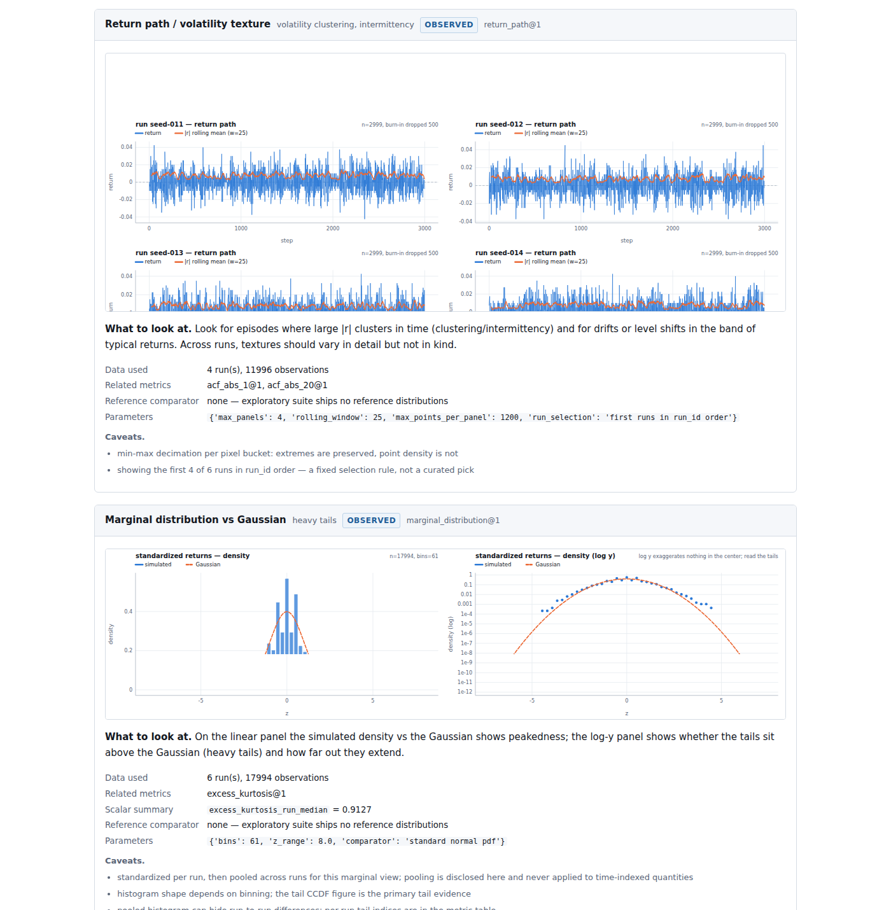

# Sieve

**A research-first simulation validation workbench. What does your
simulation actually show — and what does it prove?**

Sieve turns simulation output — a financial ABM's multi-seed runs, a GARCH
sample, a bootstrap surrogate, an LLM-agent market — into standardized
datasets, stylized-fact diagnostics, visual evidence reports and sealed,
independently verifiable evidence bundles. Locally, offline, in seconds.
There is no score.

Start with a short multi-seed ABM experiment (no reference data needed):

```
git clone https://github.com/yuitokyouni/sieve && cd sieve
pip install -e .                     # or: uv pip install -e .
sieve inspect examples/abm_ensemble  # 6 seeds, price+volume, burn-in dropped
```

That writes a sealed run directory with an exploratory HTML report — a
stylized-fact **evidence atlas**: return-path texture, marginal
distribution vs Gaussian, tail CCDF with Hill overlay, return and
volatility ACFs, aggregation profile κ(Δt), leverage kernel c(τ),
drift/variance-ratio diagnostics, and the volume–volatility relation when
volume is present:



Every card states what to look at, the data it used, the scalar metrics it
corresponds to, its parameters and its known pitfalls. Diagnostics that
the input cannot support come back `NOT_APPLICABLE` or `INSUFFICIENT`, and
registered-but-unimplemented diagnostics render as `NOT_TESTED` roadmap
cards. Nothing is aggregated into a score — by design and by test.

## The workflow

```
simulation outputs
    → standardized multi-run dataset        (sieve inspect / Python API)
    → descriptive stylized-fact diagnostics
    → visual evidence report                (sealed, offline HTML+SVG)
    → optional reference-based inference    (sieve test)
    → optional model/version comparison     (sieve compare)
    → reproducible evidence bundle          (sieve verify)
```

Sieve never certifies "the model is correct". It answers: for **this
input**, **this geometry**, **this claim** — which evidence supports,
which contradicts, and which is undetermined.

### Exploratory vs confirmatory — a hard line

- **`sieve inspect`** is exploratory. It works without any reference, on
  one short run or a 100-seed ensemble. It emits figures and descriptive
  statistics with statuses `OBSERVED` / `INSUFFICIENT` / `NOT_APPLICABLE`
  / `NOT_TESTED` — never PASS/FAIL. `OBSERVED` means "computed and
  rendered from adequate data", not "the stylized fact holds".
- **`sieve test`** is confirmatory. It evaluates a claim against a
  versioned suite's shipped empirical reference with prespecified,
  calibrated inference, and emits PASS / FAIL / WARN / NOT_TESTED /
  INSUFFICIENT per evidence dimension.

A figure can reveal anomalies a scalar test misses; a scalar test can
reject what a figure makes look fine. Neither substitutes for the other,
and the reports say so.

## Research inputs

`sieve inspect` accepts, without ever inferring a calendar, resampling, or
silently converting anything:

```
timestamp,return               # legacy Tier-0 (still works everywhere)
step,return                    # simulation time, no calendar
step,price                     # returns derived ONLY with --derive-return
run_id,step,return             # long format, many seeds in one file
experiment/                    # directory-of-runs
  manifest.yaml                #   model identity, seeds, burn-in, derivation
  runs/seed-001.csv …
```

and from Python:

```python
import sieve
ds = sieve.from_arrays(returns=r, volume=v)
ds = sieve.from_runs([{"run_id": "s1", "return": r1, "seed": 1}, ...])
ds = sieve.from_dataframe(df)          # pandas or polars
```

Rules that hold everywhere: runs are independent sampling units and are
**never concatenated**; derived returns never cross a run boundary;
price→return conversion (`log`/`simple`/`diff`) happens only when
declared and is recorded as a transform; burn-in records dropped counts
per run; non-finite values, duplicated steps and all-consuming burn-ins
are explicit errors with fix suggestions. The **sampling geometry**
(`single_long_series`, `multi_run_ensemble`, `multi_market_panel`,
`paired_runs`, `short_exploratory_series`) is declared or defaulted
structurally — what the input *can* support decides which diagnostics run,
per metric and per figure, without one inadequate metric dragging down the
rest.

## Confirmatory testing (the original golden path — unchanged)

```
sieve test examples/csv_returns --suite financial-daily@1.0 --claim descriptive-market-dynamics
```

`financial-daily@1.0` assesses long-horizon daily return simulations
against 124 frozen reference windows from six equity indices, with a
calibrated calendar-block bootstrap null (its measured size is disclosed
on every row), Holm adjustment, baseline-blindness context on every PASS,
and POST HOC badges on post-hoc diagnostics. It needs ≥ 5 non-overlapping
1000-observation windows (≈ 20 years of daily data) — that is the honest
requirement of distribution-over-windows inference, and shorter inputs get
INSUFFICIENT, which is an answer, not an error. The suite is immutable;
its content hash is recorded in every bundle that used it.
Multi-run ensembles are *detected and refused* here with guidance to
`inspect` — testing run-units against window-units would be a different
method, and Sieve does not fake it
([docs/research-workbench-migration.md](docs/research-workbench-migration.md)).

Model updates are gated by `sieve compare RUN_A RUN_B`: per-metric
CHANGED / NOT_SEPARATED verdicts, transitions against the reference gate
(REGRESSION / IMPROVEMENT / CHANGED_WITHIN_GATE / STABLE), the declared
parameter diff next to the measured changes, and a versioned approval
policy that routes review — never scores
([browse the frozen example](https://yuitokyouni.github.io/sieve/example-update/compare/report/index.html)).

## Comparing against real markets

Exploratory, any input size — overlay an index's daily returns on the
diagnostic figures (visual context only; no status depends on it):

```
python tools/fetch_index_data.py ^N225 nikkei     # or bring your own CSV
sieve inspect experiments/my_abm \
    --reference data/index_cache/nikkei_daily.csv \
    --reference-derive-return log --reference-label "Nikkei 225"
```

Confirmatory, for long daily series (~20+ years) — test against a single
index with the experimental suites `nikkei-daily@0.1` / `spx-daily@0.1`
(derived window statistics shipped, source hash recorded, inherited
calibration disclosed), or against the six-index pool with
`financial-daily@1.0`:

```
sieve test my_long_series.csv --suite nikkei-daily@0.1 --claim descriptive-market-dynamics
```

## What a run produces

```
manifest.json                 run identity, seed tree, environment
observations.parquet          per-run (inspect) or per-window (test) metric values
figures/*.svg                 deterministic, dependency-free evidence figures
figures.json                  per-figure status, parameters, caveats
results.json                  (test) per-metric inference results
report/index.html             the report, readable anywhere, no network
inspect_bundle.json |         everything above in one sealed schema
  evidence_bundle.json
bundle.sha256                 sha256sum-compatible integrity sidecar
```

**Bundles are sealed twice.** `bundle_hash` pins *what was measured* —
input content hash, suite hash, seed tree, results, figure statuses — and
excludes run IDs, timestamps, paths and machine fingerprints, so the same
input + suite + seed + package versions reproduce the same seal on any
machine. `bundle.sha256` pins *what was shipped*, including every figure
SVG. `sieve verify` checks both layers on both bundle kinds and reports
tampering as a result, not a crash
([docs/architecture.md](docs/architecture.md),
[docs/reproduce.md](docs/reproduce.md)).

## What Sieve will not do

No overall realism score. No model rankings or leaderboards. No
"certified" badges. No "8 of 11 stylized facts reproduced" counts — a
figure status is data adequacy, never a point. No silent resampling,
interpolation, frequency inference or run concatenation. No fabricated
numbers when data is insufficient. These are invariants enforced by tests
(`tests/unit/test_no_score.py`, `tests/integration/test_inspect.py`).

## The stylized-facts atlas

[docs/stylized-facts-atlas.md](docs/stylized-facts-atlas.md) maps the
eleven classic stylized facts of financial returns (Cont 2001) to
observables, scalar metrics, figures, minimum data, estimator choices,
failure modes and implementation status. Nine diagnostic figure families
are implemented; conditional heavy tails, time-scale asymmetry and
gain/loss first-passage asymmetry are registered `NOT_TESTED` with their
prespecification requirements documented — they become real by
implementation and version bump, not by silently appearing.

## CLI

```
sieve inspect INPUT [--suite S] [--out DIR] [--derive-return M]
                    [--burn-in-steps N | --burn-in-fraction F]
sieve test INPUT --suite S --claim C [--out DIR] [--seed N]
sieve compare RUN_A RUN_B    model-update regression between two sealed runs
sieve verify RUN_DIR         works on inspect and test runs; exit 0/4/3
sieve report RUN_DIR         re-render HTML from the stored bundle
sieve doctor                 environment + suite check (offline, no network)
sieve suites list|show       installed suites, their hashes and claims
sieve metrics list|show      metrics with dimensions, requirements, blind spots
sieve baselines list         baselines with declared mechanisms
sieve schemas export         JSON Schema for every durable artifact
```

Exit codes separate evaluation from execution: FAIL or INSUFFICIENT is a
*result* (exit 0); only invalid input (2), missing pieces (3), tampering
(4) or a Sieve bug (1) are errors.

## Where the science comes from

The metrics, baselines, reference statistics, calibrated inference and
every disclosed blind spot are migrated verbatim from the
[sieve-bench research repository](https://github.com/yuitokyouni/sieve-bench),
and golden regression tests pin the product to it bit-for-bit
(`tests/golden/`). Figures share the *same* computation code as the
metrics — the leverage kernel's shaded region averages to the `leverage`
metric exactly, the ACF curves hit `acf_abs_1`/`acf_abs_20` exactly, and
tests enforce it. Insurer ESG / ERM suites (NAIC-style acceptance
criteria, martingale tests) remain planned domain suites
([docs/roadmap-esg.md](docs/roadmap-esg.md)); they are a future
application of this workbench, not its center.

## Status

v0.4.0: the research workbench (multi-run inputs, `sieve inspect`, figure
registry, evidence atlas) plus the original confirmatory golden path,
which is unchanged and still frozen bit-for-bit — regenerating the shipped
example reproduces identical statuses and KS values, with the seal
re-pinned to the new version. See `STATUS.md`, `CHANGELOG.md` and
[docs/research-workbench-migration.md](docs/research-workbench-migration.md)
for what was implemented, deferred, and why.
